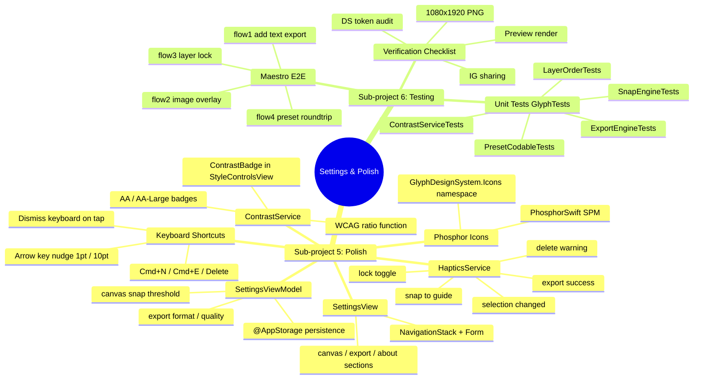

# Settings, Polish & Testing — Implementation Plan

> **For agentic workers:** Use `superpowers:subagent-driven-development` or `superpowers:executing-plans`.

**Goal:** Ship a polished, production-ready Glyph by adding a settings screen, Phosphor icons, keyboard shortcuts, WCAG contrast checking, haptics, a full unit test suite, and Maestro E2E flows.

**Architecture:** Settings are stored via `@AppStorage` in a dedicated `SettingsViewModel` injected through `@Environment`, keeping persistence logic out of views. Each UI polish concern (haptics, contrast, keyboard) lives in a focused service or view modifier that any view can adopt without coupling to the main `CanvasViewModel`. Testing targets are added to `project.yml` alongside a `maestro/` directory at the repo root for E2E flows.

**Tech Stack:** SwiftUI, `@AppStorage`, `@Observable`, XCTest, Maestro, PhosphorSwift (SPM)

---

## File Map

| Action | Path | Purpose |
|--------|------|---------|
| Create | `Sources/ViewModels/SettingsViewModel.swift` | `@Observable` + `@AppStorage` settings state |
| Create | `Sources/Views/SettingsView.swift` | NavigationStack Form UI for settings |
| Create | `Sources/Services/HapticsService.swift` | Centralized `UIImpactFeedbackGenerator` wrapper |
| Create | `Sources/Services/ContrastService.swift` | WCAG contrast ratio calculation |
| Modify | `Sources/Views/StyleControlsView.swift` | Inject contrast badge next to color picker |
| Modify | `Sources/Views/CanvasView.swift` | Keyboard shortcuts, haptics, settings gear sheet, dismiss keyboard on canvas tap |
| Modify | `Sources/ViewModels/CanvasViewModel.swift` | Arrow-key nudge action, undo manager wiring |
| Modify | `Sources/GlyphApp.swift` | Inject `SettingsViewModel` + `HapticsService` into environment |
| Modify | `ios-native/Glyph/project.yml` | Add `GlyphTests` target + PhosphorSwift SPM dependency |
| Create | `Tests/GlyphTests/SnapEngineTests.swift` | Unit tests: snap/alignment engine |
| Create | `Tests/GlyphTests/ContrastServiceTests.swift` | Unit tests: WCAG contrast ratio |
| Create | `Tests/GlyphTests/PresetCodableTests.swift` | Unit tests: style preset JSON round-trip |
| Create | `Tests/GlyphTests/LayerOrderTests.swift` | Unit tests: z-order operations |
| Create | `Tests/GlyphTests/ExportEngineTests.swift` | Unit tests: export image dimensions |
| Create | `maestro/flow1_add_text_export.yaml` | E2E: add text → font → export |
| Create | `maestro/flow2_image_overlay.yaml` | E2E: import image → text overlay → reposition → export |
| Create | `maestro/flow3_layer_management.yaml` | E2E: multi-layer reorder, lock, verify |
| Create | `maestro/flow4_preset_roundtrip.yaml` | E2E: save preset → apply to new text |

---

### Task 1: Add PhosphorSwift SPM Dependency + Update project.yml

**Files:** Modify: `ios-native/Glyph/project.yml`

> PhosphorSwift (`https://github.com/phosphor-icons/phosphor-swiftui`) is the official SwiftUI Phosphor package published at version 1.x. If SPM resolution fails at build time, fall back to the SF Symbols mapping noted in Task 2.

- [ ] **Step 1:** Open `project.yml` and add the SPM package + `GlyphTests` target:

```yaml
# Add inside the top-level `packages:` key (create it if absent)
packages:
  PhosphorSwift:
    url: https://github.com/phosphor-icons/phosphor-swiftui
    from: "1.0.0"

# Add `PhosphorSwift` to the Glyph target's dependencies
targets:
  Glyph:
    # ... existing keys ...
    dependencies:
      - package: PhosphorSwift

  GlyphTests:
    type: bundle.unit-test
    platform: iOS
    deploymentTarget: "17.0"
    sources:
      - path: Tests/GlyphTests
        createIntermediateGroups: true
    dependencies:
      - target: Glyph
    settings:
      base:
        PRODUCT_BUNDLE_IDENTIFIER: com.glyphapp.glyph.tests
        SWIFT_VERSION: "6.0"

# Add GlyphTests to the scheme's test action
schemes:
  Glyph:
    # ... existing keys ...
    test:
      config: Debug
      targets:
        - GlyphTests
```

- [ ] **Step 2:** Regenerate the Xcode project:

```bash
cd /Users/s3nik/Desktop/instagram-story-builder/ios-native/Glyph
xcodegen generate
```

- [ ] **Step 3:** Resolve packages:

```bash
xcodebuild -resolvePackageDependencies -project Glyph.xcodeproj -scheme Glyph
```

- [ ] **Step 4:** Verify build compiles cleanly:

```bash
flowdeck build --scheme Glyph
```

**Commit:** `feat: add PhosphorSwift SPM + GlyphTests target to project.yml`

---

### Task 2: Replace SF Symbols with Phosphor Icons

**Files:** Modify: `Sources/Views/CanvasView.swift`, `Sources/Views/StyleControlsView.swift`, `Sources/Views/ExportSheet.swift`, `Sources/GlyphDesignSystem.swift`

> If PhosphorSwift resolved in Task 1, use `Ph.Plus.bold()` etc. If SPM resolution failed, keep SF Symbols and add `// TODO: migrate to Phosphor once package resolves` comments. The steps below show the Phosphor path.

- [ ] **Step 1:** Add a `GlyphIcons` namespace to `GlyphDesignSystem.swift` so icon choices are tokenized in one place:

```swift
// MARK: - Icon Tokens
public extension GlyphDesignSystem {
    /// Canonical icon references for the Glyph design system.
    /// Uses PhosphorSwift (https://github.com/phosphor-icons/phosphor-swiftui).
    /// Each property returns an `Image` so call sites are swap-safe.
    enum Icons {
        // Toolbar
        public static var addText: Image    { Ph.textT.bold() }
        public static var trash: Image      { Ph.trash.bold() }
        public static var sliders: Image    { Ph.sliders.bold() }
        public static var export_: Image    { Ph.export_.bold() }
        public static var gear: Image       { Ph.gear.bold() }
        // Layer controls
        public static var lock: Image       { Ph.lock.bold() }
        public static var unlock: Image     { Ph.lockOpen.bold() }
        public static var eye: Image        { Ph.eye.bold() }
        public static var eyeSlash: Image   { Ph.eyeSlash.bold() }
        public static var grid: Image       { Ph.gridFour.bold() }
        // Selection / ordering
        public static var plus: Image       { Ph.plus.bold() }
        public static var arrowUp: Image    { Ph.arrowUp.bold() }
        public static var arrowDown: Image  { Ph.arrowDown.bold() }
    }
}
```

- [ ] **Step 2:** Replace every `Image(systemName: "plus")` usage in `CanvasView.swift` with `DS.Icons.plus` (and so on for each mapping). Example diff:

```swift
// Before
Label("Add Text", systemImage: "textformat")
// After
Label("Add Text", image: DS.Icons.addText)
// Note: Label(_, image:) accepts an Image directly in SwiftUI
```

- [ ] **Step 3:** Apply the same substitution to `StyleControlsView.swift` (sliders, eye, lock) and `ExportSheet.swift` (export, share icons).

- [ ] **Step 4:** Build and visually verify in Simulator via FlowDeck that icons render correctly in the toolbar.

```bash
flowdeck run --scheme Glyph --simulator "iPhone 16 Pro"
```

**Commit:** `feat: tokenize icons via GlyphDesignSystem.Icons + Phosphor replacements`

---

### Task 3: HapticsService

**Files:** Create: `Sources/Services/HapticsService.swift`

- [ ] **Step 1:** Create the service. It is `@MainActor` because `UIFeedbackGenerator` must run on main:

```swift
import UIKit

// MARK: - HapticsService
/// Centralized haptic feedback for Glyph interactions.
/// Inject via @Environment(HapticsService.self) and call named methods.
@MainActor
final class HapticsService {

    // MARK: Private generators (lazily allocated to avoid pre-warming cost)
    private let light   = UIImpactFeedbackGenerator(style: .light)
    private let medium  = UIImpactFeedbackGenerator(style: .medium)
    private let heavy   = UIImpactFeedbackGenerator(style: .heavy)
    private let notif   = UINotificationFeedbackGenerator()
    private let select  = UISelectionFeedbackGenerator()

    // MARK: Named interactions

    /// Called when a layer snaps to an alignment guide.
    func snapToGuide() {
        light.impactOccurred()
    }

    /// Called when a layer is locked or unlocked.
    func lockToggle() {
        medium.impactOccurred()
    }

    /// Called when a layer is deleted.
    func delete() {
        notif.notificationOccurred(.warning)
    }

    /// Called after a successful export.
    func exportSuccess() {
        notif.notificationOccurred(.success)
    }

    /// Called when the user changes the active selection.
    func selectionChanged() {
        select.selectionChanged()
    }
}
```

- [ ] **Step 2:** Register `HapticsService` in `GlyphApp.swift`:

```swift
// In GlyphApp.swift, inside WindowGroup body:
@State private var haptics = HapticsService()

// Pass to environment:
.environment(haptics)
```

- [ ] **Step 3:** Inject in `CanvasView.swift`:

```swift
@Environment(HapticsService.self) private var haptics
```

Then call `haptics.selectionChanged()` inside the overlay tap handler, `haptics.delete()` inside the delete action, and `haptics.exportSuccess()` after `ExportEngine` completes.

**Commit:** `feat: HapticsService with named interaction methods`

---

### Task 4: ContrastService + WCAG Badge

**Files:** Create: `Sources/Services/ContrastService.swift`, Modify: `Sources/Views/StyleControlsView.swift`

- [ ] **Step 1:** Create the pure-function contrast service:

```swift
import SwiftUI

// MARK: - ContrastService
/// Pure WCAG 2.1 contrast-ratio calculator.
/// Formula: (L1 + 0.05) / (L2 + 0.05) where L1 > L2.
enum ContrastService {

    // MARK: Public API

    /// Returns the WCAG contrast ratio in [1, 21].
    static func ratio(foreground: Color, background: Color) -> Double {
        let l1 = relativeLuminance(of: foreground)
        let l2 = relativeLuminance(of: background)
        let lighter = max(l1, l2)
        let darker  = min(l1, l2)
        return (lighter + 0.05) / (darker + 0.05)
    }

    /// AA pass for normal text requires ≥ 4.5 : 1.
    static func passesAA(foreground: Color, background: Color) -> Bool {
        ratio(foreground: foreground, background: background) >= 4.5
    }

    /// AA pass for large text (≥18pt bold or ≥24pt regular) requires ≥ 3 : 1.
    static func passesAALarge(foreground: Color, background: Color) -> Bool {
        ratio(foreground: foreground, background: background) >= 3.0
    }

    // MARK: Private helpers

    private static func relativeLuminance(of color: Color) -> Double {
        // Resolve to sRGB components. Falls back to 0 if resolution fails.
        var r: CGFloat = 0, g: CGFloat = 0, b: CGFloat = 0, a: CGFloat = 0
        UIColor(color).getRed(&r, green: &g, blue: &b, alpha: &a)
        return 0.2126 * linearize(r) + 0.7152 * linearize(g) + 0.0722 * linearize(b)
    }

    private static func linearize(_ channel: CGFloat) -> Double {
        let c = Double(channel)
        return c <= 0.04045 ? c / 12.92 : pow((c + 0.055) / 1.055, 2.4)
    }
}
```

- [ ] **Step 2:** Add a `ContrastBadge` view to `StyleControlsView.swift`:

```swift
// Place this private struct at the bottom of StyleControlsView.swift
private struct ContrastBadge: View {
    private typealias DS = GlyphDesignSystem
    let foreground: Color
    let background: Color

    private var ratio: Double {
        ContrastService.ratio(foreground: foreground, background: background)
    }
    private var passes: Bool {
        ContrastService.passesAA(foreground: foreground, background: background)
    }

    var body: some View {
        HStack(spacing: DS.Spacing.xs) {
            Circle()
                .fill(passes ? DS.Colors.accent : DS.Colors.error)
                .frame(width: DS.Spacing.sm, height: DS.Spacing.sm)
            Text(String(format: "%.1f:1 %@", ratio, passes ? "AA ✓" : "AA ✗"))
                .font(.system(size: DS.Typography.captionSize, weight: .medium, design: .monospaced))
                .foregroundStyle(DS.Colors.textPrimary)
        }
        .padding(.horizontal, DS.Spacing.sm)
        .padding(.vertical, DS.Spacing.xs)
        .background(DS.Colors.surface, in: RoundedRectangle(cornerRadius: DS.Radius.sm))
        .accessibilityLabel(passes
            ? "Contrast ratio \(String(format: "%.1f", ratio)) to 1, passes AA"
            : "Contrast ratio \(String(format: "%.1f", ratio)) to 1, fails AA")
    }
}
```

- [ ] **Step 3:** In `StyleControlsView.swift`, locate the color picker row and inject `ContrastBadge` below it:

```swift
// After the ColorPicker for text color:
ContrastBadge(
    foreground: viewModel.selectedOverlay?.style.textColor ?? .primary,
    background: Color(hex: GlyphDesignSystem.Colors.canvasHex)
)
```

**Commit:** `feat: ContrastService + WCAG AA badge in StyleControlsView`

---

### Task 5: SettingsViewModel + @AppStorage Persistence

**Files:** Create: `Sources/ViewModels/SettingsViewModel.swift`

- [ ] **Step 1:** Define all persisted settings keys as a private enum to avoid stringly-typed keys:

```swift
import SwiftUI

// MARK: - SettingsViewModel
/// Persists user preferences via @AppStorage.
/// Injected at app root and consumed anywhere via @Environment(SettingsViewModel.self).
@Observable
final class SettingsViewModel {

    // MARK: Canvas
    /// Whether the alignment grid is shown by default on launch.
    @ObservationIgnored
    @AppStorage("canvas.showGridByDefault") var showGridByDefault: Bool = false

    /// Snap threshold in points. Overlays within this distance snap to guides.
    @ObservationIgnored
    @AppStorage("canvas.snapThreshold") var snapThreshold: Double = 8.0

    // MARK: Export
    /// JPEG compression quality [0, 1]. 1.0 = lossless PNG (uses PNG branch).
    @ObservationIgnored
    @AppStorage("export.quality") var exportQuality: Double = 1.0

    /// Export format: "png" or "jpeg".
    @ObservationIgnored
    @AppStorage("export.format") var exportFormat: String = "png"

    // MARK: Computed helpers
    var exportFormatIsPNG: Bool { exportFormat == "png" }
}
```

- [ ] **Step 2:** Register in `GlyphApp.swift` alongside `HapticsService`:

```swift
@State private var settings = SettingsViewModel()

// Inside WindowGroup:
.environment(settings)
```

**Commit:** `feat: SettingsViewModel with @AppStorage persistence`

---

### Task 6: SettingsView

**Files:** Create: `Sources/Views/SettingsView.swift`

- [ ] **Step 1:** Build the full settings screen:

```swift
import SwiftUI

// MARK: - SettingsView
/// App settings sheet, accessible via the gear toolbar button.
struct SettingsView: View {
    private typealias DS = GlyphDesignSystem

    @Environment(SettingsViewModel.self) private var settings
    @Environment(\.dismiss) private var dismiss

    var body: some View {
        NavigationStack {
            Form {
                canvasSection
                exportSection
                aboutSection
            }
            .navigationTitle("Settings")
            .navigationBarTitleDisplayMode(.inline)
            .toolbar {
                ToolbarItem(placement: .confirmationAction) {
                    Button("Done") { dismiss() }
                        .foregroundStyle(DS.Colors.accent)
                }
            }
        }
        .presentationDetents([.medium, .large])
        .presentationDragIndicator(.visible)
    }

    // MARK: Sections

    private var canvasSection: some View {
        Section {
            @Bindable var s = settings
            Toggle("Show Grid by Default", isOn: $s.showGridByDefault)
                .tint(DS.Colors.accent)
            VStack(alignment: .leading, spacing: DS.Spacing.xs) {
                Text("Snap Threshold: \(Int(settings.snapThreshold)) pt")
                    .font(.system(size: DS.Typography.bodySize))
                Slider(value: $s.snapThreshold, in: 2...24, step: 1)
                    .tint(DS.Colors.accent)
            }
        } header: {
            Text("Canvas")
        }
    }

    private var exportSection: some View {
        Section {
            @Bindable var s = settings
            Picker("Format", selection: $s.exportFormat) {
                Text("PNG").tag("png")
                Text("JPEG").tag("jpeg")
            }
            .pickerStyle(.segmented)

            if !settings.exportFormatIsPNG {
                VStack(alignment: .leading, spacing: DS.Spacing.xs) {
                    Text("JPEG Quality: \(Int(settings.exportQuality * 100))%")
                        .font(.system(size: DS.Typography.bodySize))
                    Slider(value: $s.exportQuality, in: 0.5...1.0, step: 0.05)
                        .tint(DS.Colors.accent)
                }
            }
        } header: {
            Text("Export")
        }
    }

    private var aboutSection: some View {
        Section {
            LabeledContent("Version") {
                Text(Bundle.main.infoDictionary?["CFBundleShortVersionString"] as? String ?? "—")
                    .foregroundStyle(DS.Colors.textSecondary)
            }
            NavigationLink("Licenses") {
                LicensesView()
            }
        } header: {
            Text("About")
        }
    }
}

// MARK: - LicensesView
private struct LicensesView: View {
    private typealias DS = GlyphDesignSystem

    var body: some View {
        List {
            Section("PhosphorSwift") {
                Text("MIT License — phosphor-icons/phosphor-swiftui")
                    .font(.system(size: DS.Typography.captionSize))
                    .foregroundStyle(DS.Colors.textSecondary)
            }
        }
        .navigationTitle("Licenses")
        .navigationBarTitleDisplayMode(.inline)
    }
}
```

- [ ] **Step 2:** In `CanvasView.swift`, add a `@State private var showSettings = false` and a toolbar button that presents `SettingsView`:

```swift
// In the toolbar:
ToolbarItem(placement: .topBarTrailing) {
    Button {
        showSettings = true
    } label: {
        DS.Icons.gear
            .foregroundStyle(DS.Colors.textPrimary)
    }
    .accessibilityLabel("Settings")
}

// As a sheet modifier on the ZStack:
.sheet(isPresented: $showSettings) {
    SettingsView()
        .environment(settings)
}
```

- [ ] **Step 3:** Verify settings screen renders in Simulator:

```bash
flowdeck run --scheme Glyph --simulator "iPhone 16 Pro"
```

**Commit:** `feat: SettingsView with canvas/export/about sections`

---

### Task 7: Keyboard Shortcuts + Arrow-Key Nudge

**Files:** Modify: `Sources/Views/CanvasView.swift`, `Sources/ViewModels/CanvasViewModel.swift`

- [ ] **Step 1:** Add a `nudgeSelected(dx:dy:)` method to `CanvasViewModel.swift`:

```swift
// In CanvasViewModel.swift

/// Moves the selected overlay by (dx, dy) points.
/// Called from arrow-key handlers in CanvasView.
func nudgeSelected(dx: CGFloat, dy: CGFloat) {
    guard let id = selectedOverlayID,
          let idx = overlays.firstIndex(where: { $0.id == id }),
          !overlays[idx].isLocked else { return }
    overlays[idx].position.x += dx
    overlays[idx].position.y += dy
}
```

- [ ] **Step 2:** Add keyboard shortcuts and `.onKeyPress` to `CanvasView.swift`. Add these modifiers to the outermost `ZStack`:

```swift
// Cmd+N → add text overlay
.keyboardShortcut("n", modifiers: .command)  // attach to the add-text button

// Cmd+E → trigger export
.keyboardShortcut("e", modifiers: .command)  // attach to the export button

// Delete → remove selected overlay
.keyboardShortcut(.delete, modifiers: [])    // attach to the delete button

// Arrow keys → nudge (requires the ZStack or a focusable container to be focused)
.focusable()
.onKeyPress(keys: [.leftArrow, .rightArrow, .upArrow, .downArrow]) { press in
    let step: CGFloat = press.modifiers.contains(.shift) ? 10 : 1
    switch press.key {
    case .leftArrow:  viewModel.nudgeSelected(dx: -step, dy: 0)
    case .rightArrow: viewModel.nudgeSelected(dx:  step, dy: 0)
    case .upArrow:    viewModel.nudgeSelected(dx: 0, dy: -step)
    case .downArrow:  viewModel.nudgeSelected(dx: 0, dy:  step)
    default: break
    }
    return .handled
}
```

- [ ] **Step 3:** Dismiss keyboard on canvas tap by adding `.onTapGesture` before the overlay gestures:

```swift
// On the background canvas layer inside the ZStack:
.onTapGesture {
    UIApplication.shared.sendAction(
        #selector(UIResponder.resignFirstResponder),
        to: nil, from: nil, for: nil
    )
    viewModel.clearSelection()
}
```

**Commit:** `feat: keyboard shortcuts Cmd+N/E/Delete + arrow-key nudge`

---

### Task 8: Haptics Integration Audit

**Files:** Modify: `Sources/Views/CanvasView.swift`, `Sources/ViewModels/CanvasViewModel.swift`

- [ ] **Step 1:** Wire `haptics.selectionChanged()` wherever `selectedOverlayID` is set in `CanvasViewModel`. Add a `onSelectionChanged` callback or call directly from tap handlers in `CanvasView`:

```swift
// In the overlay tap gesture in CanvasView.swift:
.onTapGesture {
    viewModel.select(overlay: overlay.id)
    haptics.selectionChanged()
}
```

- [ ] **Step 2:** Wire `haptics.lockToggle()` to the lock/unlock button action:

```swift
// In the layer controls toolbar:
Button {
    viewModel.toggleLock(overlay: overlay.id)
    haptics.lockToggle()
} label: {
    overlay.isLocked ? DS.Icons.lock : DS.Icons.unlock
}
```

- [ ] **Step 3:** Wire `haptics.delete()` to the delete action:

```swift
Button(role: .destructive) {
    viewModel.removeSelected()
    haptics.delete()
} label: {
    DS.Icons.trash
}
```

- [ ] **Step 4:** Wire `haptics.exportSuccess()` in `ExportSheet.swift` after the save-to-photos / Instagram share confirmation callback:

```swift
// After UIImageWriteToSavedPhotosAlbum completes:
await MainActor.run { haptics.exportSuccess() }
```

- [ ] **Step 5:** Wire `haptics.snapToGuide()` inside `CanvasViewModel` wherever a snap event fires (in the drag gesture handler that checks guide proximity).

**Commit:** `polish: full haptics audit — selection, lock, delete, snap, export`

---

### Task 9: Unit Tests — Core Logic

**Files:** Create: `Tests/GlyphTests/ContrastServiceTests.swift`, `Tests/GlyphTests/SnapEngineTests.swift`, `Tests/GlyphTests/PresetCodableTests.swift`, `Tests/GlyphTests/LayerOrderTests.swift`, `Tests/GlyphTests/ExportEngineTests.swift`

> Create `Tests/GlyphTests/` directory first: `mkdir -p /Users/s3nik/Desktop/instagram-story-builder/ios-native/Glyph/Tests/GlyphTests`

- [ ] **Step 1 — ContrastServiceTests.swift:**

```swift
import Testing
@testable import Glyph
import SwiftUI

struct ContrastServiceTests {

    @Test("Pure white on pure black is 21:1")
    func whiteOnBlack() {
        let ratio = ContrastService.ratio(foreground: .white, background: .black)
        #expect(abs(ratio - 21.0) < 0.1)
    }

    @Test("Black on black is 1:1")
    func blackOnBlack() {
        let ratio = ContrastService.ratio(foreground: .black, background: .black)
        #expect(abs(ratio - 1.0) < 0.01)
    }

    @Test("Neon green #39FF14 on white passes AA large text (≥3:1)")
    func neonGreenOnWhiteLarge() {
        let accent = Color(red: 0.224, green: 1.0, blue: 0.078)
        #expect(ContrastService.passesAALarge(foreground: accent, background: .white))
    }

    @Test("Neon green #39FF14 on white fails AA normal text (<4.5:1)")
    func neonGreenOnWhiteNormal() {
        let accent = Color(red: 0.224, green: 1.0, blue: 0.078)
        #expect(!ContrastService.passesAA(foreground: accent, background: .white))
    }
}
```

- [ ] **Step 2 — SnapEngineTests.swift:** (assumes a `SnapEngine.snap(value:guides:threshold:)` static func)

```swift
import Testing
@testable import Glyph

struct SnapEngineTests {

    @Test("Value within threshold snaps to nearest guide")
    func snapsWhenClose() {
        // Guide at 200, threshold 8, value at 205 → should snap to 200
        let result = SnapEngine.snap(value: 205, guides: [200], threshold: 8)
        #expect(result == 200)
    }

    @Test("Value outside threshold does not snap")
    func noSnapWhenFar() {
        let result = SnapEngine.snap(value: 215, guides: [200], threshold: 8)
        #expect(result == 215)
    }

    @Test("Snaps to closest of multiple guides")
    func snapsToClosest() {
        let result = SnapEngine.snap(value: 203, guides: [200, 210], threshold: 8)
        #expect(result == 200)
    }
}
```

- [ ] **Step 3 — PresetCodableTests.swift:**

```swift
import Testing
@testable import Glyph

struct PresetCodableTests {

    @Test("StylePreset round-trips through JSON")
    func roundTrip() throws {
        let preset = StylePreset(
            name: "Bold Neon",
            fontName: "Helvetica-Bold",
            fontSize: 28,
            textColorHex: "#39FF14"
        )
        let data = try JSONEncoder().encode(preset)
        let decoded = try JSONDecoder().decode(StylePreset.self, from: data)
        #expect(decoded.name == preset.name)
        #expect(decoded.fontName == preset.fontName)
        #expect(decoded.fontSize == preset.fontSize)
        #expect(decoded.textColorHex == preset.textColorHex)
    }
}
```

- [ ] **Step 4 — LayerOrderTests.swift:**

```swift
import Testing
@testable import Glyph

struct LayerOrderTests {

    private func makeOverlays() -> [CanvasOverlay] {
        (0..<3).map { i in
            CanvasOverlay(id: UUID(), zIndex: i, text: "Layer \(i)")
        }
    }

    @Test("Move layer to front increases zIndex to max+1")
    func moveToFront() {
        var overlays = makeOverlays()
        let target = overlays[0].id
        CanvasViewModel.bringToFront(&overlays, id: target)
        let moved = overlays.first { $0.id == target }!
        #expect(moved.zIndex == overlays.map(\.zIndex).max()!)
    }

    @Test("Send to back sets zIndex to 0 and shifts others")
    func sendToBack() {
        var overlays = makeOverlays()
        let target = overlays[2].id
        CanvasViewModel.sendToBack(&overlays, id: target)
        let moved = overlays.first { $0.id == target }!
        #expect(moved.zIndex == 0)
    }
}
```

- [ ] **Step 5 — ExportEngineTests.swift:**

```swift
import Testing
@testable import Glyph
import UIKit

struct ExportEngineTests {

    @Test("Exported image is 1080×1920")
    @MainActor
    func exportDimensions() async throws {
        let engine = ExportEngine()
        let image = try await engine.render(overlays: [], background: .white)
        #expect(image.size.width == 1080)
        #expect(image.size.height == 1920)
    }
}
```

- [ ] **Step 6:** Run all unit tests:

```bash
flowdeck test --scheme Glyph --simulator "iPhone 16 Pro"
```

**Commit:** `test: unit tests for ContrastService, SnapEngine, Preset, LayerOrder, ExportEngine`

---

### Task 10: Maestro E2E Flow 1 — Add Text & Export

**Files:** Create: `maestro/flow1_add_text_export.yaml`

> Run Maestro flows with: `maestro test maestro/flow1_add_text_export.yaml`
> Maestro docs: https://maestro.mobile.dev/getting-started

- [ ] **Step 1:** Create the flow file:

```yaml
# maestro/flow1_add_text_export.yaml
# Flow 1: Add text → change font → export to Photos
appId: com.glyphapp.glyph
---
- launchApp:
    clearState: true

# Tap the Add Text toolbar button (accessibility label set in CanvasView)
- tapOn:
    id: "add-text-button"

# Type some story text into the text field
- tapOn:
    id: "text-input-field"
- inputText: "Glyph Story"

# Dismiss keyboard
- tapOn:
    id: "canvas-background"

# Open font picker
- tapOn:
    id: "font-picker-button"

# Select the first font in the list
- tapOn:
    index: 0
    id: "font-list-item"

# Dismiss font picker
- tapOn:
    id: "done-button"

# Tap Export
- tapOn:
    id: "export-button"

# Choose Save to Photos
- tapOn:
    text: "Save to Photos"

# Assert success toast or alert appears
- assertVisible:
    text: "Saved"
```

**Commit:** `test: Maestro flow1 — add text and export to Photos`

---

### Task 11: Maestro E2E Flow 2 — Image Overlay

**Files:** Create: `maestro/flow2_image_overlay.yaml`

- [ ] **Step 1:**

```yaml
# maestro/flow2_image_overlay.yaml
# Flow 2: Import image → add text overlay → reposition → export
appId: com.glyphapp.glyph
---
- launchApp:
    clearState: true

# Import background image from Photos
- tapOn:
    id: "import-image-button"

# Grant photos permission if prompted
- allowPermission: Photos

# Select first image in picker
- tapOn:
    index: 0
    id: "photo-picker-item"

# Add a text overlay
- tapOn:
    id: "add-text-button"
- tapOn:
    id: "text-input-field"
- inputText: "Over the image"
- tapOn:
    id: "canvas-background"

# Drag the text overlay to reposition it
- swipe:
    startX: 50%
    startY: 50%
    endX: 50%
    endY: 30%
    duration: 500

# Export
- tapOn:
    id: "export-button"
- tapOn:
    text: "Save to Photos"
- assertVisible:
    text: "Saved"
```

**Commit:** `test: Maestro flow2 — image import, text overlay, reposition, export`

---

### Task 12: Maestro E2E Flow 3 — Layer Management

**Files:** Create: `maestro/flow3_layer_management.yaml`

- [ ] **Step 1:**

```yaml
# maestro/flow3_layer_management.yaml
# Flow 3: Add multiple layers → reorder → lock one → verify locked layer doesn't move
appId: com.glyphapp.glyph
---
- launchApp:
    clearState: true

# Add first text layer
- tapOn:
    id: "add-text-button"
- tapOn:
    id: "text-input-field"
- inputText: "Layer One"
- tapOn:
    id: "canvas-background"

# Add second text layer
- tapOn:
    id: "add-text-button"
- tapOn:
    id: "text-input-field"
- inputText: "Layer Two"
- tapOn:
    id: "canvas-background"

# Select Layer One and bring to front
- tapOn:
    text: "Layer One"
- tapOn:
    id: "bring-to-front-button"

# Select Layer Two and lock it
- tapOn:
    text: "Layer Two"
- tapOn:
    id: "lock-button"

# Assert lock icon is visible (layer is locked)
- assertVisible:
    id: "locked-indicator"

# Attempt to drag Layer Two — it should not move
- swipe:
    startX: 50%
    startY: 60%
    endX: 80%
    endY: 60%
    duration: 300

# Layer Two should still be at roughly center-x (locked)
# We verify by re-tapping it at its original position
- tapOn:
    text: "Layer Two"
- assertVisible:
    id: "locked-indicator"
```

**Commit:** `test: Maestro flow3 — multi-layer reorder and lock verification`

---

### Task 13: Maestro E2E Flow 4 — Preset Round-Trip

**Files:** Create: `maestro/flow4_preset_roundtrip.yaml`

- [ ] **Step 1:**

```yaml
# maestro/flow4_preset_roundtrip.yaml
# Flow 4: Save style preset → apply preset to a new text layer
appId: com.glyphapp.glyph
---
- launchApp:
    clearState: true

# Add a text layer
- tapOn:
    id: "add-text-button"
- tapOn:
    id: "text-input-field"
- inputText: "Preset Source"
- tapOn:
    id: "canvas-background"

# Open style controls and apply a custom style
- tapOn:
    text: "Preset Source"
- tapOn:
    id: "style-controls-button"

# Tap Save Preset
- tapOn:
    id: "save-preset-button"

# Name the preset in the dialog
- tapOn:
    id: "preset-name-field"
- inputText: "Bold Neon"
- tapOn:
    text: "Save"

# Add a second text layer
- tapOn:
    id: "canvas-background"
- tapOn:
    id: "add-text-button"
- tapOn:
    id: "text-input-field"
- inputText: "Preset Target"
- tapOn:
    id: "canvas-background"

# Apply the saved preset to the new layer
- tapOn:
    text: "Preset Target"
- tapOn:
    id: "style-controls-button"
- tapOn:
    id: "presets-tab"
- tapOn:
    text: "Bold Neon"

# Assert the preset name is shown as applied
- assertVisible:
    text: "Bold Neon"
```

**Commit:** `test: Maestro flow4 — save and apply style preset`

---

### Task 14: Final Verification Checklist

**Files:** No new files — verification pass only.

- [ ] **Step 1 — Export dimensions:** Run the unit test and confirm 1080×1920:

```bash
flowdeck test --scheme Glyph --simulator "iPhone 16 Pro" --only ExportEngineTests
```

- [ ] **Step 2 — Instagram sharing:** Launch on Simulator, tap export, tap "Share to Instagram Stories", verify the IG app opens or the "Instagram not installed" alert appears.

- [ ] **Step 3 — DS token audit:** Search for raw color literals and raw spacing values that should use DS tokens:

```bash
grep -rn "Color(red:" ios-native/Glyph/Sources/Views/
grep -rn "\.padding([0-9]" ios-native/Glyph/Sources/Views/
```

Both should return zero matches (or only intentional exceptions with `// intentional` comment).

- [ ] **Step 4 — ComponentCatalog previews:** Open `ComponentCatalog.swift` in Xcode and verify all `#Preview` macros render without crash.

- [ ] **Step 5 — All unit tests green:**

```bash
flowdeck test --scheme Glyph --simulator "iPhone 16 Pro"
```

Expected output: `Test Suite 'GlyphTests' passed`

- [ ] **Step 6 — Maestro flows:** Run all four flows sequentially:

```bash
maestro test maestro/flow1_add_text_export.yaml
maestro test maestro/flow2_image_overlay.yaml
maestro test maestro/flow3_layer_management.yaml
maestro test maestro/flow4_preset_roundtrip.yaml
```

All four should exit 0.

- [ ] **Step 7 — Accessibility audit:** In Simulator, enable Accessibility Inspector and verify every toolbar button has a non-empty accessibility label.

**Commit:** `chore: final verification pass — all tests green, DS audit clean`

---

## Architecture Diagram



---

## Dependency Order

Tasks must be executed in this order due to dependencies:

1. **Task 1** (project.yml + SPM) — unblocks everything
2. **Task 2** (Phosphor icons) — depends on Task 1 SPM resolution
3. **Task 3** (HapticsService) — independent after Task 1
4. **Task 4** (ContrastService) — independent after Task 1
5. **Task 5** (SettingsViewModel) — independent after Task 1
6. **Task 6** (SettingsView) — depends on Tasks 2 + 5
7. **Task 7** (Keyboard shortcuts) — independent after Task 1
8. **Task 8** (Haptics integration) — depends on Task 3
9. **Task 9** (Unit tests) — depends on Tasks 3, 4, source models existing
10. **Tasks 10–13** (Maestro flows) — depend on full app being wired up (Tasks 1–8)
11. **Task 14** (Verification) — last; depends on all prior tasks

Tasks 3, 4, 5, and 7 can be parallelized after Task 1 completes.
